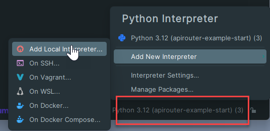
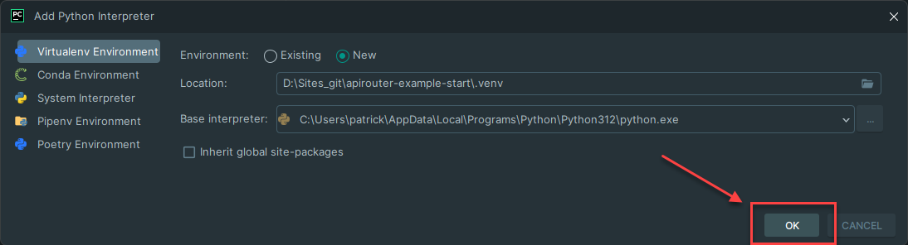
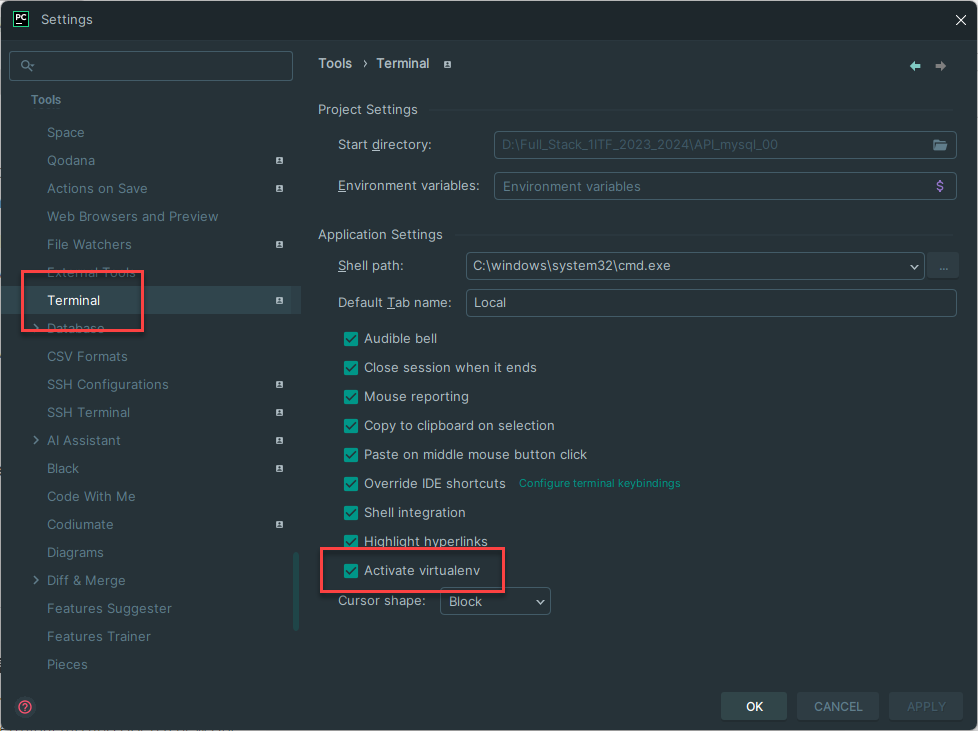

# This is the start repo for the FastAPI router tutorial

## Set up the repository
- `git clone https://github.com/pverhaert/apirouter-example-start.git` : clones the repository
- `cd apirouter-example-start` : changes the directory to the newly cloned repository
- `rm -rf .git` : removes the `.git` directory, so you can start a new repository if you want
- `cp .env.example .env` : copies the `.env.example` file to `.env`, so you can use it to set your environment variables

## Open the repository in PyCharm
The first time you open the repository in PyCharm, you will be asked to create a virtual environment and install the requirements.  
The requirements are listed in the `requirements.txt` file.  
(`requirements.txt` is [a special file in Python](https://www.jetbrains.com/help/pycharm/managing-dependencies.html) that lists all the packages that are required to run the application.)

- Click on the `Create` button to create the virtual environment and install the requirements

If you don't see this dialog, you can also create the virtual environment and install the requirements manually. 
(see remark at the end of this file)


## Run the FastAPI application
- Open a terminal window in PyCharm and run the following command to start the FastAPI application:  
(Make sure that the virtual environment is activated. You should see `(.venv)` at the beginning of the command line.
```bash
uvicorn main:app --reload --port 4400
```

## Open the FastAPI application in your browser
- Open your browser and go to the following URL: [http://127.0.0.1:4400](http://127.0.0.1:4400)


## Remark: manual installation of the virtual environment and requirements

Do the following steps to create the virtual environment and install the requirements manually:

- Close all terminal windows
- Click, at the bottom right of the PyCharm window, on the **Python x.xx (...)** tab
- Click on the **Add New Interpreter** and select **Add Local Interpreter**

- Leave the default settings and click on the **OK** button

- Open the **terminal** tab in the settings and verify that **Activate virtualenv** is checked

- Open a new terminal window and verify that the virtual environment is activated   
  (You should see `(.venv)` at the beginning of the command line. If not, restart PyCharm and open a new terminal window.)
- Run the following commands in the terminal to install the requirements:
```bash
pip install -r requirements.txt
```

Now you can run the FastAPI application as described above.
```bash
uvicorn main:app --reload --port 4400
```
